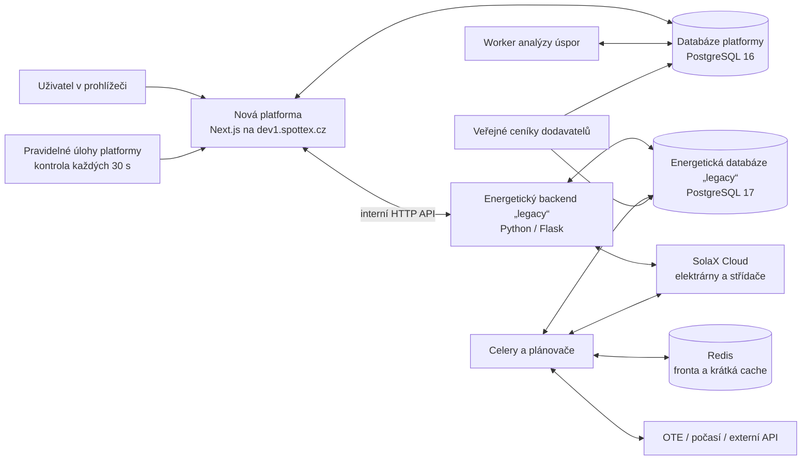
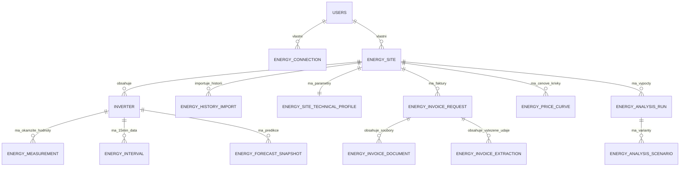
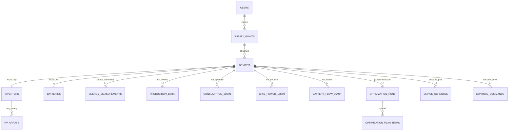
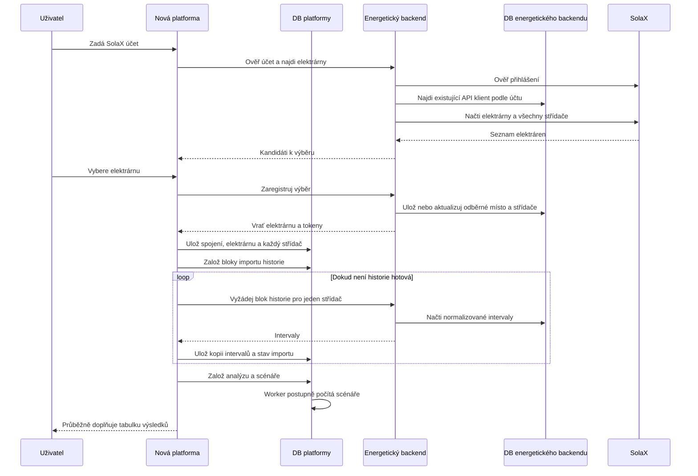

# Mapa energetických dat Spottex

Stav vývojového prostředí k 28. 7. 2026.

## Jednoduchý obrázek

## Co znamenají používané názvy

| Název | Co tím přesně myslíme |
|---|---|
| **Nová platforma / web / administrace** | Aplikace Next.js, která vykresluje veřejný web, přihlášení, zákaznickou administraci i novou analýzu úspor. Má také vlastní serverová API. |
| **Databáze platformy** | Nový PostgreSQL kontejner `spottex-platform-dev-db-1`. Obsahuje účty platformy, obraz elektráren pro web, kopii intervalových dat, faktury, novou analýzu, ceníkový katalog, platby a úlohy. |
| **Legacy / energetický backend** | Starší Python aplikace, která už umí komunikovat se SolaX, stahovat historii, tvořit predikce, optimalizační plány a posílat povely střídačům. Slovo „legacy“ neznamená nepoužívaný systém; dnes je stále energetickým motorem. |
| **Energetická databáze legacy** | PostgreSQL kontejner `spottex_backend-db-1`. Obsahuje původní odběrná místa, fyzická zařízení, přístupy ke SolaX, surová měření, časové řady, predikce, optimalizace, povely a starší ceníkový katalog. |
| **Celery** | Program pro spouštění práce na pozadí ve starém energetickém backendu. Není to databáze. |
| **Redis** | Krátkodobá fronta Celery, zámky a třicetiminutová cache rozpracovaného připojení elektrárny. Není to hlavní úložiště energetických dat. |
| **Worker** | Samostatně běžící proces, který pravidelně bere práci z fronty nebo databáze. |

Slovo **backend** je samo o sobě nejednoznačné. Nová platforma má vlastní backendová API a vedle ní běží starý energetický backend. V komunikaci je proto lepší používat názvy **platforma** a **energetický backend**.

## 1. Databáze nové platformy

Veřejný web a zákaznická aplikace nemají dvě různé databáze. Sdílejí jednu databázi platformy, rozdělenou do schémat:

| Schéma | Co ukládá | Příklady tabulek |
|---|---|---|
| `general` | Zákazníky a energetická data potřebná pro nové UI a analýzu | `users`, `energy_connection`, `energy_site`, `inverter`, `energy_measurement`, `energy_interval` |
| `tariff` | Nový kontrolovaný katalog cen | `energy_company`, `energy_product`, `energy_product_version`, `distribution_tariff`, `market_price_point` |
| `jobs` | Úlohy na pozadí a audit událostí | `scheduled_job`, `audit_log`, `email_outbox` |
| `auth` | Ověření e-mailu a obnovení hesla | `email_verification`, `password_reset` |
| `payment` | Nabídky, objednávky a předplatné | `product`, `cart`, `payment`, `subscription` |
| `content` | Obsah veřejného webu | `blog_post`, `reference_project`, `site_settings` |
| `analytics` | Souhlasy a analytické události webu | `consent_record`, `analytics_event` |

### Energetická část platformy

Zjednodušeně:

- `energy_connection` říká, že účet platformy smí komunikovat s energetickým backendem.
- `energy_site` je elektrárna tak, jak ji vidí nové UI.
- `inverter` je každý jednotlivý střídač. Elektrárna se dvěma střídači musí mít dva řádky.
- `energy_measurement` je poslední nebo okamžitý snímek.
- `energy_interval` je kopie historie po intervalech pro grafy a výpočty.
- `energy_history_import` a jeho bloky popisují průběh kopírování historie.
- `energy_site_technical_profile` ukládá EAN, sazbu, jistič, limity, parametry FVE a baterie i zdroj každé hodnoty.
- tabulky `energy_invoice_*` uchovávají šifrovaný dokument, stav zpracování a verzované vytěžené údaje.
- `energy_analysis_run` je jedno spuštění analýzy; `energy_analysis_scenario` jsou jednotlivá políčka tabulky sazba × nákup/výkup × řízení.

K 28. 7. 2026 obsahuje nový katalog 9 energetických společností, 45 produktů/verzí, 7 distribučních sazeb a 28 800 bodů spotového trhu.

## 2. Databáze energetického backendu

Hlavní skupiny:

| Schéma | Co ukládá | Důležité tabulky |
|---|---|---|
| `general` | Původní model zákazníka a fyzické technologie | `users`, `supply_points`, `devices`, `inverters`, `pv_arrays`, `batteries` |
| `backup` | Surové snímky ze zdrojových API a servisní zálohy | `energy_measurements` |
| `control` | Normalizované časové řady, predikce, ceny, optimalizace a povely | `production_15min`, `consumption_15min`, `grid_power_15min`, `battery_flow_15min`, `optimization_runs`, `device_schedule`, `control_commands` |
| `tariff` | Starší a širší ceníkový model | `suppliers`, `supplier_tariff`, `supplier_tariff_price`, `distribution_tariff`, `distribution_tariff_variants` |

K 28. 7. 2026 je v `backup.energy_measurements` přibližně 309 tisíc surových záznamů. Starší katalog obsahuje 20 dodavatelů a 513 tarifů. Tento katalog není automaticky totéž, co 45 zkontrolovaných produktů nové analýzy.

## 3. Jak tečou data při zákaznické cestě

## 4. Co běží na pozadí

### Nová platforma

| Proces | Úloha |
|---|---|
| `app` | Web, zákaznická i administrátorská API |
| `jobs` | Každých 30 sekund zavolá interní obsluhu úloh |
| `analysis-worker` | Bere výpočty analýzy z tabulky `jobs.scheduled_job` a zapisuje scénáře |
| `mailpit` | Jen vývojová schránka pro e-maily |

Frontou nové platformy je prakticky tabulka `jobs.scheduled_job` v PostgreSQL. Samostatný kontejner `jobs` je pouze pravidelný budík.

### Energetický backend

| Proces | Úloha |
|---|---|
| `web` | API pro připojení účtu, živá data a historii |
| `invertor_updater` | Stahuje telemetrii a tvoří predikce výroby a spotřeby |
| `prices_updater` | Stahuje OTE a kurz ČNB |
| `optimization_updater` | Počítá optimální plán baterie/nákupu/prodeje |
| `control_broadcaster` | Překládá plán na konkrétní povely střídači |
| `savings_updater` | Průběžně dopočítává provozní úspory |
| `celery_beat` | Časový plánovač úloh Celery |
| `celery_worker` | Provádí obecné úlohy z Redis fronty |
| `inverter_workers` | Udržuje oddělenou frontu a relaci pro každý střídač |
| `db_backup` | Zálohuje PostgreSQL |

## 5. Kde hledat chybu

| Co uživatel vidí | Nejpravděpodobnější vrstva |
|---|---|
| Přihlášení nebo stránka je prázdná | nová platforma `app`, její log nebo DB |
| „Účet se nepodařilo připojit“ ještě před výběrem elektrárny | spojení platforma → energetický backend, přihlášení SolaX, developer API |
| Elektrárna je v seznamu, ale chybí jeden střídač | mapování SolaX plant → legacy `devices/inverters` nebo legacy → platforma |
| Graf má málo historie | bloky `energy_history_import`, úloha v `scheduled_job`, legacy časové řady |
| Výroba a spotřeba jsou přehozené či záporné | převod surové telemetrie na `production/consumption/grid_power` |
| Predikce vyrábí v noci | vstupní časová zóna, model, normalizace vstupů nebo zápis predikce |
| Analýza čeká ve frontě | `analysis-worker`, `scheduled_job`, stav `energy_analysis_run` |
| Čísla analýzy nesedí | vstupní intervaly, ceníková křivka, distribuční sazba nebo vzorec scénáře |
| Řízení plán vytvoří, ale zařízení ho neprovede | `device_schedule` → Redis/Celery → inverter worker → `control_commands` |
| Faktura se nahraje, ale údaje se nevyplní | `energy_invoice_document`, extrakční proces a `energy_invoice_extraction` |

## 6. Dnešní chyba připojení

Přihlášení k SolaX bylo úspěšné. Energetický backend ale při každém novém průchodu zkoušel v portálu vytvořit další aplikaci `Spottex Test API`. Portál změnil nebo nenačetl očekávanou položku menu a Selenium skončilo timeoutem. Nová platforma proto dostala HTTP 502 a zobrazila obecnou chybu.

Opravené chování:

1. backend vyhledá již uložený API klient podle e-mailu SolaX účtu;
2. živým přihlášením ověří zadané heslo;
3. použije existující API klient místo vytváření duplicitní aplikace;
4. načte seznam elektráren a všechny jejich střídače přes SolaX API.

Kontrolní přehrání po opravě vrátilo 10 elektráren a pro `MS Vetrnik` dva střídače.

## 7. Největší architektonické riziko

Stejná informace dnes může existovat na více místech:

- elektrárna a střídače jsou v obou PostgreSQL databázích;
- časové řady jsou primárně v energetickém backendu a jejich kopie v platformě;
- ceníky existují ve starém i novém modelu;
- úlohy na pozadí používají dva různé mechanismy.

Proto musí mít každý datový typ jasný zdroj pravdy:

| Datový typ | Doporučený zdroj pravdy |
|---|---|
| SolaX zařízení, surová telemetrie, řízení | energetický backend |
| Uživatel platformy, zákaznický stav a oprávnění | databáze platformy |
| Intervaly použité konkrétní analýzou | neměnný snapshot v databázi platformy |
| Nové veřejné ceníky a konkrétní zákaznická smlouva | databáze platformy |
| Výsledek analýzy | databáze platformy |
| Povely a jejich skutečné provedení | energetický backend, do platformy jen auditní kopie |

